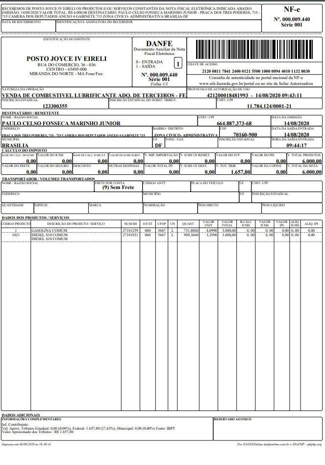
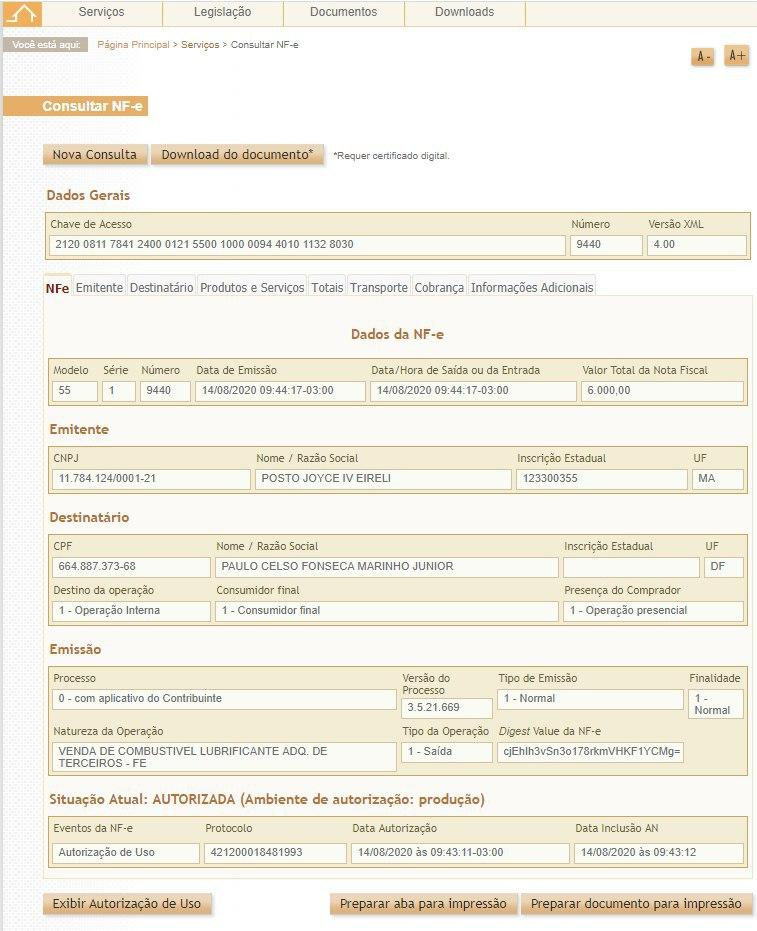

# Operação Tanque Furado

## O prazo para entrega da auditoria é PLACEHOLDER

## Siga as instruções
Não se trata de um procedimento simples, mas com paciência e tranquilidade será possível auditar todas as notas que você receberá por e-mail.

> Vocês receberão a quantidade de notas que vocês solicitarem no site do instituto OPS por e-mail.

Não queira fazer auditoria em muitas notas de maneiras "mais ou menos". Faça bem feito, com bastante cuidado, ainda que isso represente auditar poucas notas.

## Conhecendo a Nota Fiscal Eletrônica
> Objetivo é fazer entender o que é uma Nota Fiscal Eletrônica, como ela é composta e como conseguiremos chegar nas informações que queremos:
- Números dos cupons fiscais
- O nome de quem está esses cupons fiscais

Ela é um documento de existência apenas digital, emitido e armazenado eletronicamente, com o intuito de documentar uma operação de circulação de mercadorias ou uma prestação de serviços, ocorrida entre as partes.

#### DANFE
Quando se compra algo pela internet, por exemplo, você recebe um papel como este e que se chama **DANFE**, que significa **Documento Auxiliar da Nota Fiscal Eletrônica**.  
O DANFE existe para mostrar, de forma sintética, dados da nota fiscal eletrônica que é, como já dissemos, apenas digital.

Para que possamos auditar as notas fiscais de abastecimentos pagos com dinheiro público e que foram cuidadosamente escolhidas para a [Operação Tanque Furado 2](https://www.youtube.com/playlist?list=PLEcPUxZXprcohbVBBP4k-R-Z9FYhq6xIQ "Playlist no Youtube da Operação Tanque Furado"), teremos que visualizar a **Nota Fiscal Eletrônica (NF-e)** a partir dos Danfes já selecionados.  
Em apenas alguns casos não será preciso converter Danfe em NF-e.

> São muitos nomes, mas calma que a sistemática é simples. Usaremos a DANFE para chegar na nota fiscal inteira!

Esta é a Nota Fiscal Eletrônica. A parte que realmente nos interessa:

Vale lembrar que o nosso objetivo é identificar o nome do cliente que deverá estar marcado no cupom fiscal eletrônico
