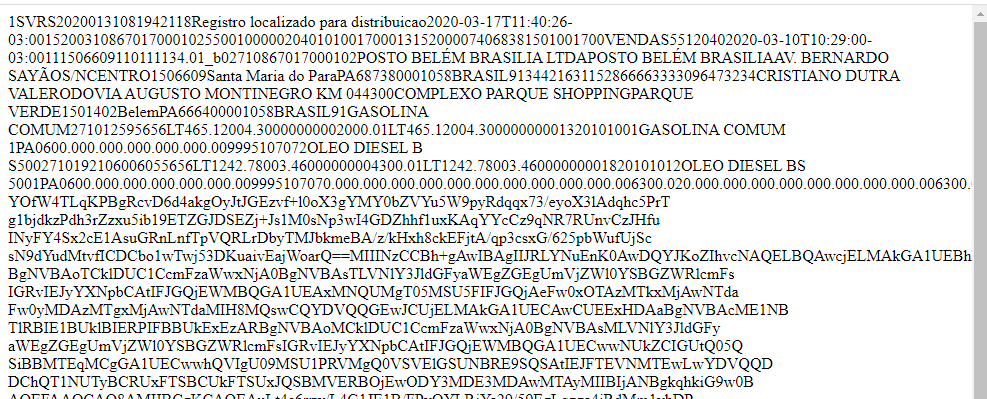

# Operação Tanque Furado

Esta é a segunda etapa da **Operação Tanque Furado** que vai entender como deputados federais usam dinheiro da verba indenizatória para abastecer veículos.

Os dados levantados nesta operação serão juntados aos já apurados na primeira edição. As irregularidades encontradas serão denunciadas à câmara e o [Instituto OPS](https://institutoops.org.br/ "Site do Instituto OPS") vai exigir a [devolução dos valores aos cofres públicos](https://institutoops.org.br/o-que-ja-fizemos/ "Valor já devolvido pela OPS").

> O colaborador terá uma semana de prazo, a partir do recebimento das notas solicitadas, para retornar com seus resultados.

## O prazo para participação popular é o dia 15 de outubro de 2020

## Siga as instruções
Não se trata de um procedimento simples, mas com paciência e tranquilidade será possível auditar todas as notas que você receberá por e-mail.

> Vocês receberão a quantidade de notas que vocês solicitarem no site do instituto OPS por e-mail.

Não queira fazer auditoria em muitas notas de maneiras "mais ou menos". Faça bem feito, com bastante cuidado, ainda que isso represente auditar poucas notas.

## Recebendo notas para auditar

O Instituto OPS selecionou todas as notas fiscais de 2020 que possam conter “cupons de troia”.

Para receber essas notas você precisa [preencher um simples cadastro](imagens/cadastro.png) no [site do Instituto OPS](https://institutoops.org.br/operacao-tanque-furado-2 "Link do cadastro"). Você receberá um e-mail em até 24h com as notas que solicitou.

## Conhecendo a Nota Fiscal Eletrônica
> Objetivo é fazer entender o que é uma Nota Fiscal Eletrônica, como ela é composta e como conseguiremos chegar nas informações que queremos:
- Números dos cupons fiscais
- O nome de quem está esses cupons fiscais

Ela é um documento de existência apenas digital, emitido e armazenado eletronicamente, com o intuito de documentar uma operação de circulação de mercadorias ou uma prestação de serviços, ocorrida entre as partes.

#### DANFE

Quando se compra algo pela internet, por exemplo, você recebe um papel como este e que se chama **DANFE**, que significa **Documento Auxiliar da Nota Fiscal Eletrônica**.  
O DANFE existe para mostrar, de forma sintética, dados da nota fiscal eletrônica que é, como já dissemos, apenas digital.

Para que possamos auditar as notas fiscais de abastecimentos pagos com dinheiro público e que foram cuidadosamente escolhidas para a [Operação Tanque Furado 2](https://www.youtube.com/playlist?list=PLEcPUxZXprcohbVBBP4k-R-Z9FYhq6xIQ "Playlist no Youtube da Operação Tanque Furado"), teremos que visualizar a **Nota Fiscal Eletrônica (NF-e)** a partir dos Danfes já selecionados.  
Em apenas alguns casos não será preciso converter Danfe em NF-e.

#### Cupom Fiscal

É aquele que comumente recebemos em mercados, padarias e outros comércios mais populares.

No QR Code, ou logo acima dele tem uma numeração de 44 números que com eles conseguiremos visualizar a NFC-e.

> São muitos nomes, mas calma que a sistemática é simples. Usaremos a DANFE ou Cupom Fiscal para chegar na nota fiscal inteira!

### Esta é a Nota Fiscal Eletrônica.

A parte que realmente nos interessa:

**Vale lembrar que o nosso objetivo é identificar o nome do cliente que deverá estar marcado na NFC-e**

## Preparando para a auditoria

### Visualizando a NF-e a partir da Danfe

1. Copiar (num bloco de notas ou similar), os 44 dígitos (Chave de acesso) que estão [logo abaixo do código de barras](imagens/danfePasso1.jpg "Destaque para a chave de acesso"). **Copie sem espaços**.

2. No [site do Instituto OPS](https://institutoops.org.br/consulta-nfe/), [clique em NOTA FISCAL ELETRÔNICA](imagens/danfeSiteOps.jpg "Imagem do site do Instituto OPS") e cole os 44 números da [Chave de Acesso previamente copiados](imagens/danfePasso2.jpg "Ilustração das instruções") na página da Receita Federal que irá abrir. Marque a opção "não sou um robô" e clique em continuar.

3. **Mantenha os números dos cupons e notas fiscais em seu computador, pois você precisará deles para encaminhar o caso ao Instituto OPS se houver irregularidade!**

4. A Nota Fiscal Eletrônica [possui informações fiscais](imagens/danfePasso3.jpg "Ilustração das informações necessárias") da empresa que a emitiu e de quem a recebeu, organizadas em abas.  
_Identifique a UF. Vamos precisar dessa informação daqui a pouco._

5. Para visualizarmos os números de cupons fiscais é preciso clicar em [informações adicionais](imagens/danfePasso4.jpg "Localização do botão informações adicionais").

6. As chaves de acesso das Notas Fiscais Eletrônicas são identificadas como [Documentos Fiscais Referenciados](imagens/danfePasso5.jpg "Localização dos documentos fiscais referenciados"). Cada Chave de Acesso refere-se a um cupom fiscal.

### Visualizando NF-e diretamente

Se o modelo recebido for [igual ao dessa imagem](imagens/nfe1.jpg "Modelo nota fiscal eletrônica"), ela **já é a Nota Fiscal Eletrônica**. Você vai precisar apenas [rolar a tela até chegar nos cupons fiscais](imagens/nfe2.jpg "Exemplo de chaves de acesso") que já estão nela e iniciar a auditoria!

> Numa Nota Fiscal podem ter vários cupons. Por isso deve-se ter cuidado ao pedir várias notas para fiscalizar, pois cada cupom desse deverá ser investigado!

### Outras possibilidades de encontrar os códigos dos cupons fiscais

> Algumas notas fiscais já estão sendo disponibilizadas sem o danfe, o que significa que não precisaremos fazer todo aquele processo para chegar até a nf-e para, somente depois, chegar aos cupons.

1. Se você se deparar com uma NF-e como esta:   
Basta rolar a tela até o final. Você encontrará os [códigos dos cupons](imagens/possibilidade1-2.png).  
Agora é só seguir os passos que você já aprendeu!

2. Se você se deparar com isso:   
Não se desespere!  
Você precisará apenas [localizar os 44 dígitos](imagens/possibilidade2-2.png) para gerar a nota fiscal eletrônica. Para isso, localize o seguinte: **03:00**. Copie os próximos **44 dígitos**.
    + Depois é só acessar a [página da operação tanque furado 2](https://institutoops.org.br/consulta-nfe), clicar na imagem da NF-e, colar o código copiado e prosseguir com o que você já aprendeu.

3. Se você encontrar isso:   
Pode correr para o abraço. O site da ops (graças ao fenômeno Vanderlei Denir) já disponibiliza os 44 dígitos e o link para gerar a nota fiscal eletrônica. Daí pra frente você já sabe o que fazer!

## Vamos iniciar a auditoria!

Agora que você já sabe onde encontrar as chaves dos cupons fiscais nas notas fiscais eletrônicas, vamos começar a auditoria cidadã!

1. Lembra-se das chaves de acesso dos cupons fiscais que vimos há pouco? Pois é... vamos dissecar cada um deles e para isso precisaremos apenas copiá-los em um bloco de notas ou similar.  
[Copie **SEM ESPAÇOS** a chave do primeiro cupom](imagens/auditoria1.jpg "Início da auditoria").

2. Novamente no [site do Instituto OPS](https://institutoops.org.br/consulta-nfe/), [clique na UF correspondente](imagens/auditoria2.jpg "Ilustração do site da OPS") de onde foi emitida a nota fiscal.

3. Chegamos na página da receita estadual, local onde vamos coletar as informações que precisamos.  
Para isso você deve [colar a chave de acesso no campo específico](imagens/auditoria3.jpg "Ilustração de onde colar a chave de acesso"), clicar em “não sou robô” (ou digite o Captcha que aparecer) e depois clique em Continuar.  
Lembre-se que estamos falando [dessas chaves de acesso](imagens/chavesdeacesso.png).

> Habemus coupon!

4. Este é o [cupom fiscal eletrônico (NFC-e)](imagens/auditoria4.jpg "imagem do cupom fiscal eletrônico"). Agora você precisa observar, na aba “**consumidor**”, o nome que aparece. Além disso, veja quantos abastecimentos estão registrados.
    + Se estiver em nome de alguma empresa, **BINGO!** A despesa é irregular. Você já pode marcar o cupom como irregular nas suas anotações.
> Para saber se é uma Empresa, basta verificar
Se há **CNPJ** [NA PRIMEIRA LINHA DO CAMPO **CONSUMIDOR**](imagens/verificacnpj.png). _No caso de pessoa física aparecerá CPF_.

    + **Não é comum que haja mais de um abastecimento por cupom fiscal. Se houver mais de 3 abastecimentos** você poderá marcar como irregular.  
    [Neste exemplo](imagens/verificacnpj.png) há apenas um abastecimento.

    + **Somente** despesas com **combustíveis e lubrificantes** podem ser pagas com dinheiro da verba indenizatória. Qualquer outro produto constante na nota é despesa irregular.
    [Neste exemplo](imagens/verificacnpj.png) há apenas gasolina.

    + Somente o deputado e seus assessores podem usufruir do dinheiro público para abastecimentos. Qualquer nome diferente que apareça é uma despesa irregular.  
    [Neste exemplo](imagens/verificacnpj.png) há o nome de uma empresa.

### Como eu saberei se o nome que está no cupom é de algum ASSESSOR de deputado(a)?  

Na página da [Operação Tanque Furado 2](https://ops.net.br/deputado-federal/secretario) é só clicar no [botão “ver secretários” correspondente ao parlamentar que você está auditando](imagens/ver-secretarios.png).

## Enviar o resultado da auditoria

Antes de lhe mostrar como enviar o resultado de sua auditoria precisamos considerar duas possibilidades:

+ ### Pode não haver irregularidades quando...

    + O Cupom fiscal não possuir informação do cliente (pode até haver alguma irregularidade na despesa, mas não temos como saber).
    + O cupom fiscal está em nome do(a) deputado(a) ou de algum de seus secretários de gabinete.

+ ### Pode haver irregularidades quando...

    + O cupom estiver em nome de empresa
    + A Nota Fiscal não possuir cupom fiscal
    + O Cupom Fiscal estiver em nome de alguém que não seja o(a) deputado(a) ou de algum secretário parlamentar
    + Houver três ou mais despesas com combustível em um único cupom fiscal
    + O item listado no cupom fiscal não for combustível e/ou lubrificante

 Agora que você já é um expert em auditar despesas com combustíveis e lubrificantes pagas com dinheiro da verba indenizatória e já auditou sua primeira nota, é chegada a hora de enviar o resultado para ao instituto ops.

 ### Enviando o resultado da auditoria para o iOPS

 O Instituto OPS preparou um [formulário bastante simples](https://docs.google.com/forms/d/e/1FAIpQLSfiE7kSta-m-B4EZQLan63ExgO2ohxZ12nAU9TJbZOKlgCHgw/viewform) para você enviar seus resultados.

**Mesmo que você não tenha encontrado qualquer irregularidade, ainda assim será preciso enviar seus resultados.**

[O formulário é bem simples](imagens/formularioenvio.png).

Ele deverá ser preenchido Para cada nota fiscal auditada, independentemente da quantidade de cupons.

> Uma nota fiscal, um envio de formulário.

Se você tiver dúvidas, tente uma das opções:

+ Acesse a [página da operação tanque furado 2](https://institutoops.org.br/operacao-tanque-furado-2/) e escolha [uma das opções](imagens/ajuda.png)

+ Entre no [grupo da OPS no Telegram](https://t.me/joinchat/FI-1aRXoGqfcSQWZPoB-vw). Tem um montão de gente lá que poderá lhe auxiliar.

## Mãos à obra!

Realização  
**Instituto OPS**

[Seja um doador](https://institutoops.org.br/apoio)
